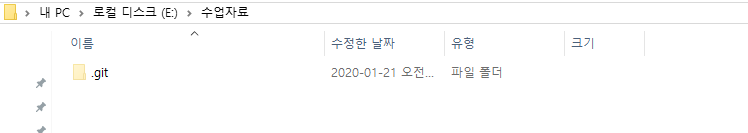

# Git basic

> Git은 분산형 버전관리 시스템이다.
>
> 소스코드의 이력을 확인하고 협엽 단계에서 활용할 수 있다.

## 1. 기본 설정

* 윈도우에서 깃을 활용하기 위해서는 `git bash`가 필요하다.

  * [Git for Windows](https://gitforwindows.org/)

* 기본적으로 소스코드의 버전 정보를 기록하는 작성자(`author`) 설정이 필요하다.

  ```bash
  $ git config --global user.name "ahrtz"
  $ git config --global user.email "ahrtzzinn@gmail.com"
  ```

* 설정한 작성자 정보를 확인하기 위해서 아래 명령을 실행한다.

  ```bash
  $ git config --global -l
  user.email=ahrtzzinn@gmail.com
  user.name=ahrtz
  ```

### gitignore

> 프로젝트를 진행할 때, 개발 환경 혹은 프로젝트 사정 상 git 으로 관리될 필요가 없거나 올라가면 안되는 파일이 있다. 이러한 파일들은 .gitignore에 입력

		* 프로젝트 루트 경로에 위치시키는 것이 기본이지만, 하위 경로에 위치시켜도 하위경로 기준으로 gitignore 설정이 적용된다.
		* 프로젝트를 시작할때 어떠한 내용을 걸어야 하는지 모르는 경우 [gitignore.io](https://gitignore.io/)를 확인한다


## 2. 로컬 저장소 활용법

### 2.1 Git 저장소 설정

> 특정 프로젝트 폴더에서 `git`을 활용하기 위해서 아래 명령어를 실행한다.

```bash
$ git init 
Initialized empty Git repository in E:/수업자료/.git/
```

* `git init`이 정상적으로 완료되면 루트경로에 `.git`이라는 숨김 폴더가 생성된다. 앞으로 모든 git 관련 동작들은 이 폴더에 기록된다.



* git bash 에서 master라는 브랜치 정보가 표기된다.

```bash
multicampus@DESKTOP-KVCQHCD MINGW64 /e/수업자료 (master)
```

### 2.2 Add

> git에서 커밋을 하고 싶은 파일을 `staging area`로 이동시키는 명령어

```bash
$ git add a.txt 		# 특정 파일을 add
$ git add images/		# 특정 폴더를 add
$ git add . 		    # 모든 파일 및 폴더를 add
```

#### add 이전상태

추적하고 있지 않은 파일이 있다고 알려주며 ,`git add`를 통해 track 을 하도록 권유한다.

```bash
$ git status
On branch master

No commits yet

Untracked files:
  (use "git add <file>..." to include in what will be committed)
        a.txt
        b.txt

nothing added to commit but untracked files present (use "git add" to track)
```

#### add 이후상태(bash 기준)

add 를 한 파일은 commit 할 준비가 되었다고 알려주고, add를 하지 않은 파일은 여전히 추적하지 않는 파일이라고 알려준다.

```bash
$ git add a.txt
$ git status
On branch master

No commits yet

Changes to be committed:
  (use "git rm --cached <file>..." to unstage)
        new file:   a.txt

Untracked files:
  (use "git add <file>..." to include in what will be committed)
        b.txt

```

따라서 git 작업을 할때 항상 `git status` 명령어를 통해서 현재 상태를 확인해야 한다.

## 3. Commit

> 실제 Git을 통해 이력(버전)을 남기기 위해서는 `commit`을 해야한다.

* commit을 남길때는 항상 commit 메세지를 작성한다. 메세지는 해당 이력에 대한 정보를 가지고 있다.

```bash
$ git commit -m '커밋메세지 작성'
[master (root-commit) c4377ee] 커밋메세지 작성
 2 files changed, 0 insertions(+), 0 deletions(-)
 create mode 100644 a.txt
 create mode 100644 b.txt

```

* commit 이력을 확인하기 위해서는 아래 명령어를 실행

```bash
$ git log
commit c4377ee069335ce29dcc6107942ef5a6abffd98a (HEAD -> master)
Author: ahrtz <ahrtzzinn@gmail.com>
Date:   Tue Jan 21 09:51:12 2020 +0900

    커밋메세지 작성

$ git log --oneline
c4377ee (HEAD -> master) 커밋메세지 작성
```

* 변동 사항이 발생할 경우 `add` -> `commit`과정을 다시 징행한다.
  * `add`:커밋할 대상 파일을 선정하는 작업
  * `commit`: 이력을 확정하는 작업


## 4. 원격 저장소(remote repository) 활용하기 

> git != Github
>
> git 을 기반으로 원격 저장소를 제공해주는 서비스는 다양하다.
>
> 우리는 가장 범용적인 서비스인 GitHub을 기준으로 활용해보자.

### 4.1 기본설정

#### 1) 원격 저장소 설정

```bash
$ git remote add origin github_URL
```

원격 저장소(remote)를 `origin`이라는 이름으로 `github_url`을 설정한다.

* `origin` 말고 원하는 이름을 설정해도 되지만, 일반적으로 `origin`을 사용한다.

* 아래 명령어를 통해 저장된 원격 저장소 목록을 확인할 수 있다.

```bash
$ git remote -v 
```

* 잘못 설정한 경우, 아래 명령어를 통해 삭제 가능하다.

```bash
$git remote rm origin
$git remote rm -v
```

### 4.2 PUSH

> 원격 저장소에 upload 하기 위해서 `push`명령어를 사용한다.

* `add`와 `commit`이 끝난 상태에서 원격 저장소와 연결이 되어있을 경우 

```bash 
$ git push origin master 
```

### 4.3 PULL

> 작업하기전 원격 저장소와 파일들이 동일한 상태를 체크하기 위해 항상 `git pull`하는 습관을 들이도록 하자 