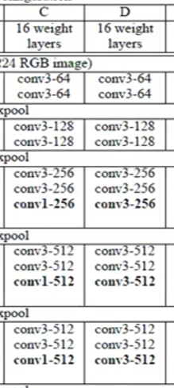

위 모델이 가장 좋다고 함 d 

## 임베딩레이어 

차원을 줄여주는거 

자연어의 경우 shape 가 너무 커서 차원의 저주에 빠지게 된다. 

그래서 이걸 벡터값으로 바꿔버림

점점 학습하면서 유사한 단어끼리는 모아준다

## LSTM LAYER? 

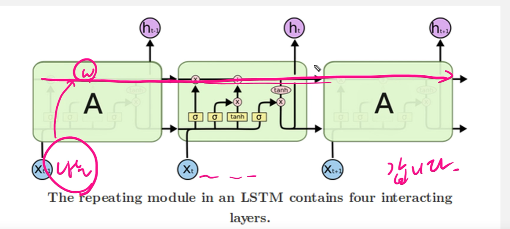

중요한 가중치는 넘겨주고 안중요한건 날리고 등등한다 

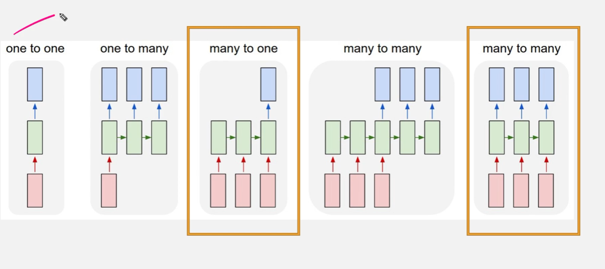

모델링은 여러개가 있는데 저 두가지만 중점적으로 한다 

3번째 껀 4번 문제 5번째껀 5번 문제에서 사용된다. 

```python
# many to one
tf.keras.layers.LSTM(64)
# many to many 
tf.keras.layers.LSTM(64,return_sequences=True)

# 만약 many to one 에서 lstm 을 겹쳐서 쌓으면
tf.keras.layers.LSTM(64,return_sequences=True)
tf.keras.layers.LSTM(64,return_sequences=True)
tf.keras.layers.LSTM(64,return_sequences=True)
tf.keras.layers.LSTM(64)
```

## bidirectional layer? 

양 방향에서 예측이 가능하게 하는 layer 

```python
# 사용법 
Bidirectional(LSTM(64))
```

# 시계열 데이터 분석


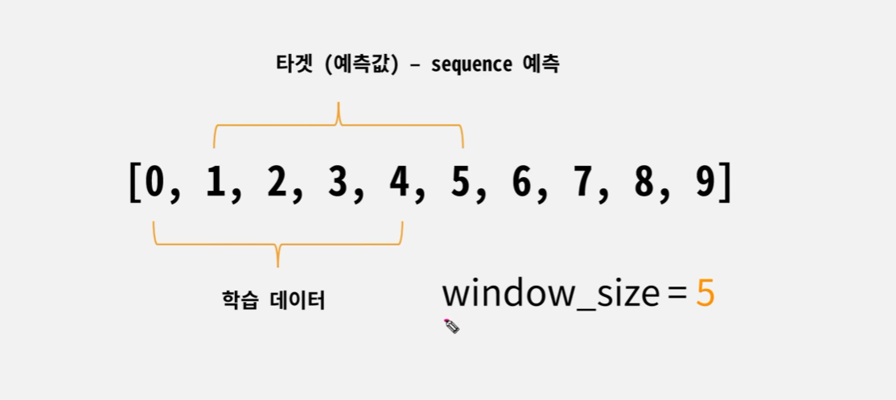

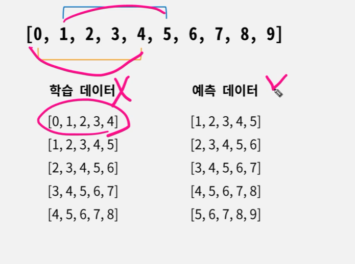

이건 many to many 기법 (이게 시험에 나오는 영역)

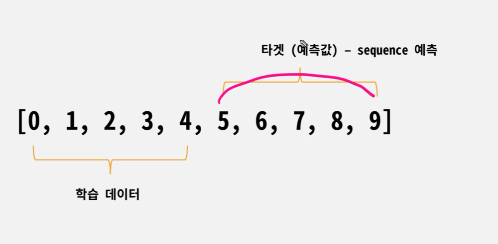


## drop_remainder

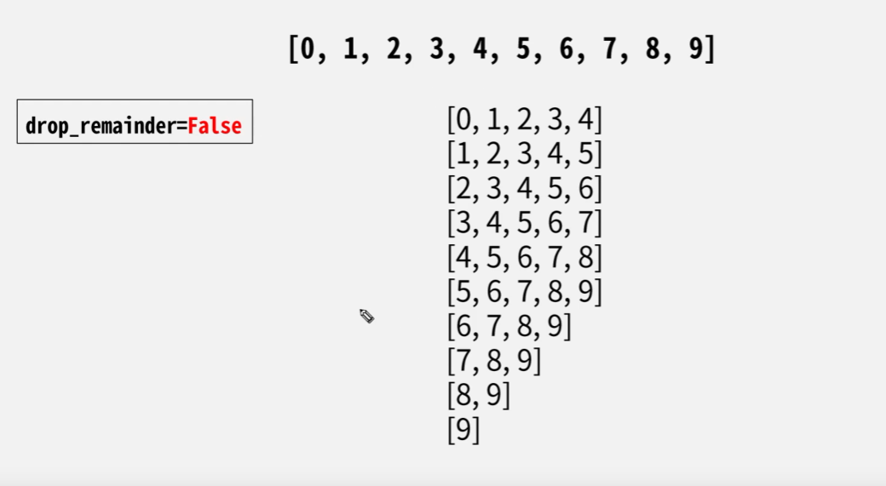

## shuffle_buffer

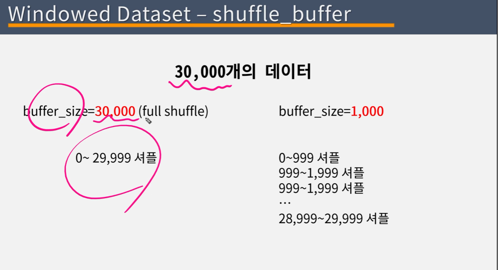

예시

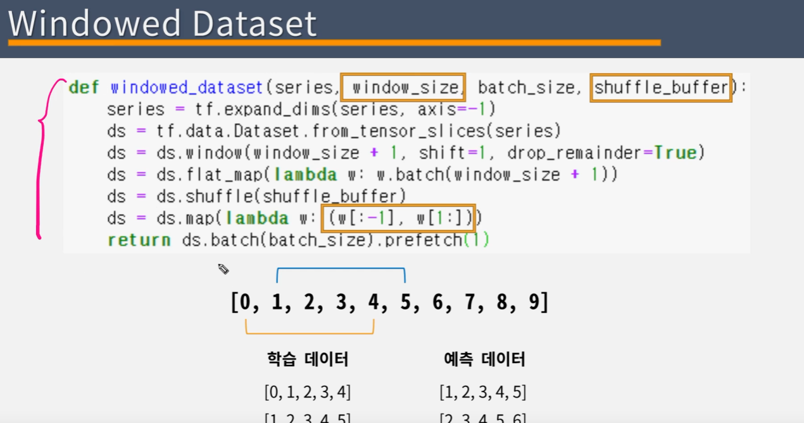

전처리가 복잡하기 때문에 옵션값만 넣어서 구현하면 된다. 

## window Dataset

- window size 는 학습데이터 뿐 아니라 예측데이터 까지 포함해야된다
- drop_remainder = True 꼭준다 
- flat_map <- 2차원에서 구성 할때 flatten 처럼 펼쳐주는애 (윈도우 사이즈+a) 만 일치시키면된다. 
- 마지막 줄은 x와 y 를 분할한다. 

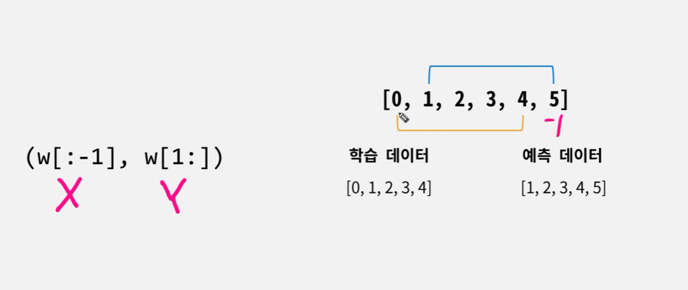

과거 5일치로 한개를 알고싶으면 

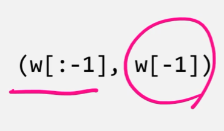

many to one 모델 

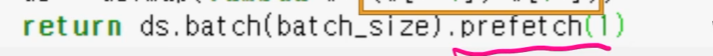

### prefetch(1)

학습할땐 1번 배치 만들고 학습 -> 2번배치 만들고 학습 -> 3번배치 만들고 학습

prefetch 는 배치를 미리 만들어 놓게 되는 옵션 